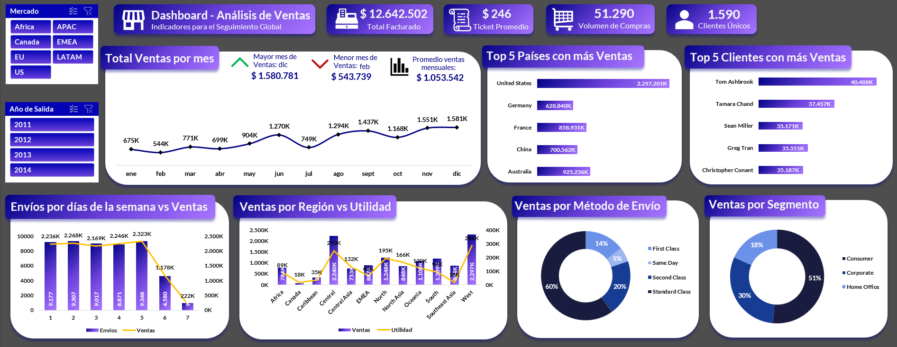

# 📊 Dashboard de Ventas - ElectroNova

> ⚠️ **Aviso sobre los datos**: Los datos utilizados en este proyecto provienen de un curso de formación y están protegidos por derechos de autor. Por esa razón, no se incluyen en este repositorio. El análisis y visualización se muestran únicamente con fines demostrativos.

## 📚 Caso de estudio
ElectroNova es una empresa líder en la venta de productos de oficina y mobiliario a nivel global.  
Ofrece una amplia gama de artículos, incluyendo accesorios, mobiliario, suministros de oficina y tecnología.

## 🎯 Desafío
Desarrollar una herramienta efectiva para analizar y gestionar sus operaciones comerciales, facilitando la toma de decisiones basada en datos.

## 📖 Descripción
Dashboard interactivo de ventas que presenta indicadores clave como:

- Rendimiento mensual
- Ventas por día de la semana
- Ingresos por categoría o segmento
- Comparativas de desempeño

El proyecto fue desarrollado en Excel utilizando tablas dinámicas y segmentadores, con el objetivo de proporcionar una visualización clara, dinámica y útil para análisis estratégicos.

## 📸 Dashboard Preview

-----------------------------------------------------------------------------------------------------------------------------------------------------------------------------------

# 📊 Sales Dashboard - ElectroNova

>⚠️ **Notice about the data**: The data used in this project comes from a training course and is protected by copyright. Therefore, it is not included in this repository. The analysis and visualizations are shared for demonstration purposes only.

## 📚 Case Study
ElectroNova is a global leader in the sale of office supplies and furniture.  
The company offers a wide range of products including accessories, furniture, office supplies, and technology.

## 🎯 Challenge
Develop an effective tool to analyze and manage their business operations, supporting data-driven decision-making.

## 📖 Description
An interactive sales dashboard that presents key performance indicators such as:

- Monthly performance
- Sales by day of the week
- Revenue by category or segment
- Performance comparisons

The project was built in Excel using pivot tables and slicers, aiming to deliver a clear, dynamic, and insightful visualization for strategic analysis.
